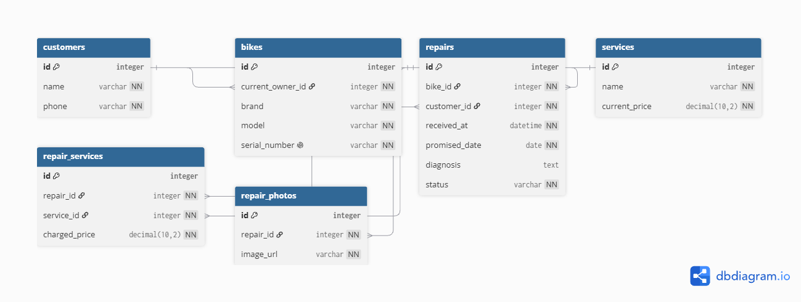

# Domain Model

## Diagram



## DBML

```dbml
Table customers {
  id integer [pk, increment]
  name varchar [not null]
  phone varchar [not null]
}

Table bikes {
  id integer [pk, increment]
  current_owner_id integer [not null]
  brand varchar [not null]
  model varchar [not null]
  serial_number varchar [not null, unique]
}

Table repairs {
  id integer [pk, increment]
  bike_id integer [not null]
  customer_id integer [not null]
  received_at datetime [not null]
  promised_date date [not null]
  diagnosis text
  status varchar [not null]
}

Table services {
  id integer [pk, increment]
  name varchar [not null]
  current_price decimal(10,2) [not null]
}

Table repair_services {
  id integer [pk, increment]
  repair_id integer [not null]
  service_id integer [not null]
  charged_price decimal(10,2) [not null]
}

Table repair_photos {
  id integer [pk, increment]
  repair_id integer [not null]
  image_url varchar [not null]
}

Ref: customers.id < bikes.current_owner_id
Ref: bikes.id < repairs.bike_id
Ref: customers.id < repairs.customer_id
Ref: repairs.id < repair_services.repair_id
Ref: services.id < repair_services.service_id
Ref: repairs.id < repair_photos.repair_id
```

## Repair lifecycle

A repair can move through these states:

- `received`: the bike has arrived at the shop.
- `diagnosed`: a mechanic has identified the problem.
- `awaiting_approval`: the shop is waiting for the customer's decision.
- `approved`: the customer accepted the proposed repair.
- `in_progress`: the bike is being repaired.
- `ready_for_pickup`: the bike can be collected by the customer.
- `rejected`: the customer did not approve the proposed repair.
- `picked_up`: the bike has left the shop.

### Allowed transitions

For a simple repair that does not need customer approval:

`received` → `in_progress` → `ready_for_pickup` → `picked_up`

For a repair that needs diagnosis and approval:

`received` → `diagnosed` → `awaiting_approval` → `approved` → `in_progress` → `ready_for_pickup` → `picked_up`

If the customer rejects the proposed repair:

`received` → `diagnosed` → `awaiting_approval` → `rejected` → `ready_for_pickup` → `picked_up`

### Transitions that are not allowed

- `awaiting_approval` → `in_progress` is not allowed because the shop must wait for the customer's approval.
- `rejected` → `in_progress` is not allowed because the customer rejected the repair.
- `picked_up` cannot transition to another state because the repair is finished and the bike has left the shop.